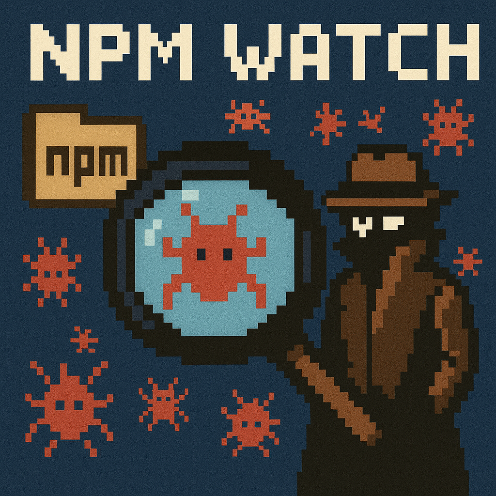

# npm-watch


A comprehensive malware monitoring tool for NPM packages that helps protect your software supply chain by tracking and scanning package updates for potential security threats.

## Overview

npm-watch is designed to monitor NPM packages for malicious code and Zero Day Malware Detection. It does not work in the traditional SCA Fashion to reports CVEs. It can extract package lists from Software Bill of Materials (SBOM) files or Azure DevOps Package Feeds, then continuously monitor these packages for updates and perform security scanning using multiple detection engines.

## Features

- **Multi-source Package Discovery**
  - Extract NPM packages from SBOM files
  - Query Azure DevOps Package Feeds for organization-wide package inventory
  - Support for multiple Azure DevOps organizations

- **Malware Detection**
  - Check packages against known malicious package databases
  - Local scanning with integrated security engines:
    - [malcodev](https://github.com/SecureCoded/malcodev) - Machine learning-based malware detection
    - [guard-dog](https://github.com/DataDog/guard-dog) - Static analysis security scanner

- **Continuous Monitoring**
  - Track package updates and new versions
  - Automated scanning of newly published versions
  - Scope-aware package organization (@scope/package support)

## Installation

```bash
pip install npm-watch
```

Or install from source:

```bash
git clone https://github.com/rothoma2/npm-watch
cd npm-watch
pip install -e .
```

## Configuration

Create a `config.ini` file in your project directory:

```ini
[azure]
organization_names = "your-org1,your-org2,your-org3"
```

## Environment Variables

Set the following environment variables:

```bash
export AZDO_PAT="your-azure-devops-personal-access-token"
export AZDO_ORG="your-organization-name"  # Optional if using config file
```

## Usage

### Command Line Interface

```bash
# Run with default configuration
npm-watch

# Specify custom config file
npm-watch --config /path/to/config.ini
```

### Python API

```python
from npm_watch.main import main

# Run the monitoring process
main()
```

## How It Works

1. **Package Discovery**: npm-watch reads your configuration and discovers NPM packages from:
   - Azure DevOps Artifact Feeds across your organizations
   - SBOM files (planned feature)

2. **Package Analysis**: For each discovered package, the tool extracts:
   - Package name and scope
   - Current version information
   - Publication dates
   - Dependency relationships

3. **Security Scanning**: New package versions are scanned using:
   - Database lookups against known malicious packages
   - Local static analysis with malcodev
   - Behavioral analysis with guard-dog

4. **Monitoring & Alerting**: Continuous monitoring provides:
   - Real-time alerts for suspicious packages
   - Regular reports on package security status
   - Integration with CI/CD pipelines


## Security Considerations

- Store Azure DevOps PAT tokens securely and rotate them regularly
- Limit PAT token permissions to read-only access for package feeds
- Run npm-watch in isolated environments for enhanced security
- Regularly update the malicious package databases

## Roadmap

- [ ] SBOM file parsing support
- [ ] Integration with additional malware scanning engines
- [ ] Web dashboard for monitoring results
- [ ] Slack/Teams notification support
- [ ] Support for other package managers (PyPI, Maven, NuGet)
- [ ] CI/CD pipeline integration templates

## Contributing

We welcome contributions! Please see our [Contributing Guidelines](CONTRIBUTING.md) for details on:

- Code style and standards
- Testing requirements
- Pull request process
- Issue reporting

## License

This project is licensed under the MIT License - see the [LICENSE](LICENSE) file for details.

## Support

- **Issues**: Report bugs and feature requests via [GitHub Issues](https://github.com/rothoma2/npm-watch/issues)
- **Documentation**: See our [Wiki](https://github.com/rothoma2/npm-watch/wiki) for detailed documentation
- **Security**: Report security vulnerabilities privately via email

## Acknowledgments

- [malcodev](https://github.com/SecureCoded/malcodev) for ML-based malware detection
- [guard-dog](https://github.com/DataDog/guard-dog) for static analysis capabilities
- Azure DevOps team for comprehensive package management APIs
